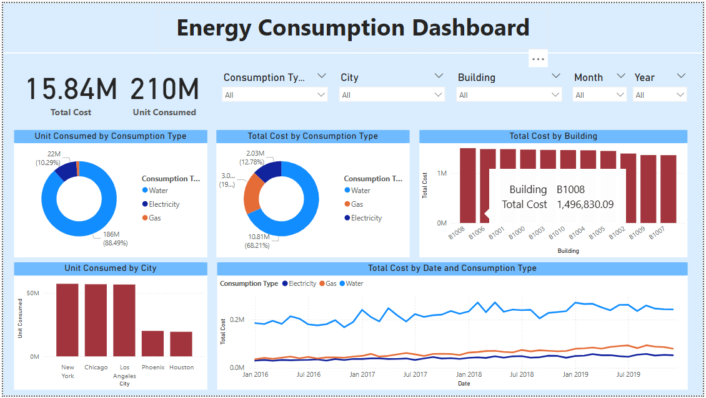

# ⚡ Energy Consumption Dashboard

This repository contains an interactive Power BI dashboard designed to visualize and analyze energy consumption data. The dashboard provides key insights into energy usage patterns, facilitating data-driven decision-making.

---

## 📊 Dashboard Overview

The Power BI dashboard offers the following features:

- **Total Energy Consumption**: Displays the overall energy usage over a specified period.
- **Consumption Trends**: Line charts illustrating energy consumption trends over time.
- **Regional Breakdown**: Pie and bar charts showing energy usage across different regions or sectors.
- **Key Performance Indicators (KPIs)**: Highlights critical metrics such as peak consumption hours and average daily usage.

---

## 🗂️ Repository Contents

- `Energy Consumption.pbix`: The Power BI dashboard file containing all visualizations and data models.
- `Dashboard.png`: A snapshot of the dashboard for quick reference.

---

## 🛠️ Getting Started

To explore or modify the dashboard:

1. **Install Power BI Desktop**  
   Download and install [Power BI Desktop](https://powerbi.microsoft.com/desktop/).

2. **Open the Dashboard**  
   Launch Power BI Desktop and open the `Energy Consumption.pbix` file.

3. **Connect to Data Source**  
   If the dashboard requires a data source, ensure you have access and update the data connections as needed.

---

## 🔄 Data Refresh

The dashboard is configured for weekly data refreshes.  
To update the data:

1. Open the dashboard in Power BI Desktop.
2. Navigate to the **Home** tab.
3. Click on **Refresh** to update the visuals with the latest data.

---

## 📌 Notes

- Ensure that any external data sources are accessible and that credentials are up to date.
- Customize the dashboard visuals to align with specific analytical needs or preferences.

---

## 📧 Contact

For questions, feedback, or collaboration opportunities, please reach out via [GitHub Issues](https://github.com/SuhailaElnemr/Energy_Consumption/issues) or contact me directly.

---

🌱 *Built with purpose to promote sustainable energy analysis and data-driven insights.*
